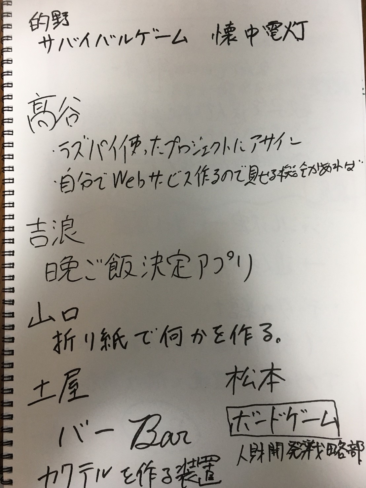

# monodsukuri
## 的野
- サバイバルゲーム(懐中電灯を使った)
運動できるゲームを作る
## 高谷
- ラズパイ使ったプロジェクトに適宜アサイン
- 自分のwebサービス披露
## 吉浪
- 晩御飯決定アプリ
    - ご飯を決定の補助
    - なんでも良い(大学生に多いような)を解消する
    - 和洋食ジャンルを絞る  

データの集計
調理器具、時間、食材を考慮した決定
作るか？食べるか？
 アプリの開発環境、手法
## 山口
- 折り紙で何かを作る

不折正方形１枚折
## 土屋
バー  カクテルを作る装置
## 松本
- ボードゲーム
人材開発に使えるもの

