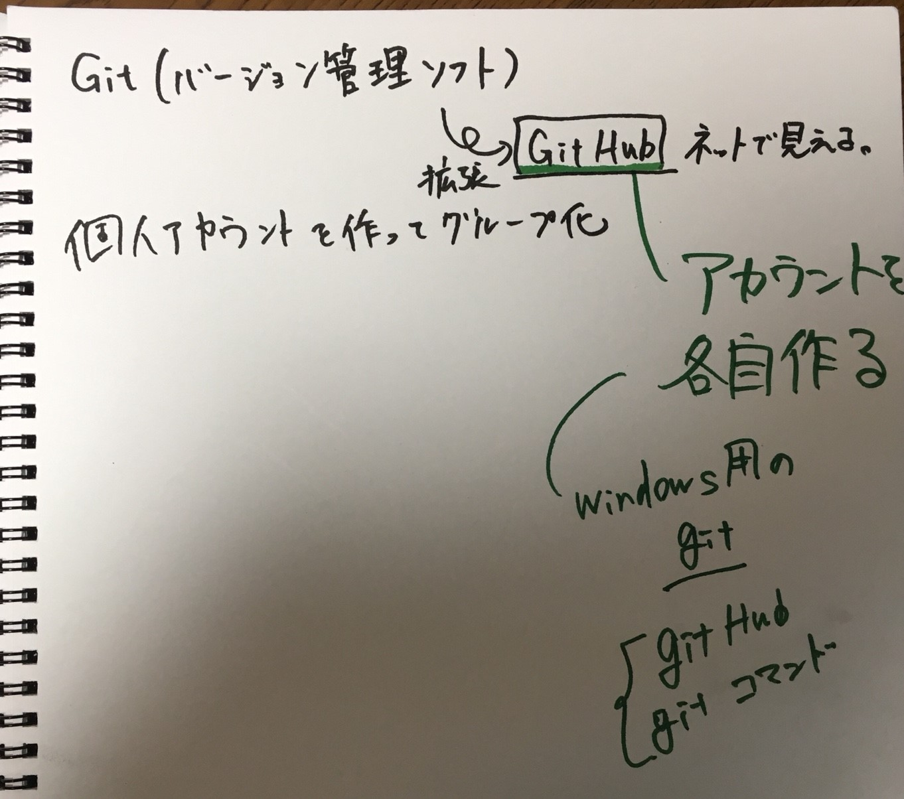

# Git
いわゆるバージョン管理ソフト。
プログラムのコードのバージョンを管理することで、バグを修正したせいで不都合が生じた場合にロールバックしたり  
複数人が別々にコードを作って最後に統合したりできる。
くわしくは[こういうところとか](https://www.maytry.net/git-basis-with-image-for-beginner/)を見た方が早いと思う。  

## Github
Gitをwebで公開することで多くの人が開発に携わったり意見交換、チーム開発しやすくするためのサービス。
簡単なコードやドキュメントの変更ならGithub上でも十分可能  

